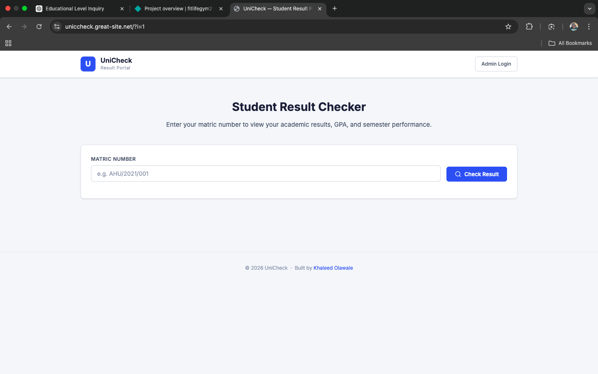
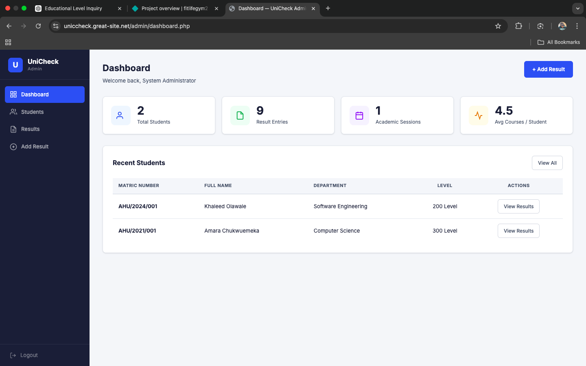

# 🎓 UniCheck — Result Checker System

UniCheck is a web-based result checking system built with PHP and MySQL, designed to allow students to securely check their academic results while providing an admin dashboard for managing student data and results.

---

## 🚀 Live Demo
https://uniccheck.great-site.net/

---

## 🛠️ Built With
- PHP
- MySQL
- HTML
- CSS
- JavaScript

---

## 📂 Project Structure

uniccheck/
├── index.php           # Student portal (public)
├── database.sql        # Database setup file
├── includes/config.php # Database connection & helpers
├── admin/
│   ├── login.php
│   ├── dashboard.php
│   ├── students.php
│   ├── add_result.php
│   └── logout.php
└── assets/
    ├── css/style.css
    └── js/main.js

---

## 📌 Features

### 👨‍🎓 Student Portal
- Input matric number to check results
- Displays student academic records
- Simple and user-friendly interface

### 🛠️ Admin Panel
- Secure login system
- Dashboard with overview stats
- Add and manage students
- Upload and manage results per course
- Logout functionality

---

## ⚙️ Setup Instructions

### 1. Clone the repository
git clone https://github.com/khaleedolawale/uniccheck

---

### 2. Import Database
- Open phpMyAdmin
- Create/select your database
- Import `database.sql`

⚠️ Note:
- Remove `CREATE DATABASE` from the SQL file if using shared hosting (e.g. InfinityFree)

---

### 3. Configure Database Connection

Edit:
includes/config.php

Update:
$host = "your_host";
$user = "your_db_user";
$password = "your_db_password";
$database = "your_database_name";

---

### 4. Run the Project
- Place files in your server directory (e.g. `htdocs`)
- Open in browser:
http://localhost/uniccheck/

---

## 🔐 Security Note
- Passwords should be stored using hashing (`password_hash`)
- Always validate and sanitize user input

---

## 🎯 Purpose
This project was built to simulate a real-world student result management system, demonstrating backend development skills, database integration, and admin-based content management.

---

## 📸 Screenshots

---

## 📬 Contact
For collaboration, feedback, or opportunities, feel free to reach out.

---

## ⭐ Acknowledgements
Built as part of practical learning and real-world application of PHP and MySQL.
